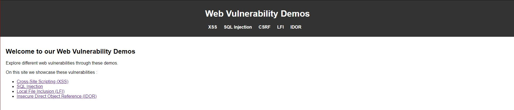
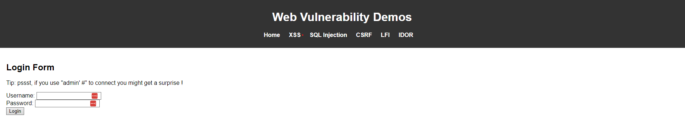

# Web Attacks Demo Site
ESILV 2023-2024 - OCC2 - OnlyHacks Team

## :information_source: Introduction

Small Website made to showcase different web vulnerabilites and to help explain how to spot them and prevent these vulnerabilities on real web pages !

Vulnerabilites showcased :
- XSS (Cross-Site Scripting) basic js inclusion
- SQL Injection
- LFI
- IDOR
- CSRF (planned)
- more ?

## :wrench: Setup

Ensure you have Docker Desktop if you are on windows or that Docker is installed on your Linux machine.

Then simply go at the root of the directory and run :

```sh
docker compose build
docker compose up -d
```
Then simply go to http://localhost:80 !

## :camera: Screenshots

Homepage of the website :


SQLI Demo :

